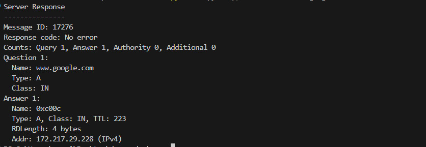

# DNS Resolver in Python

A simple Python-based DNS resolver that utilizes the UDP protocol to query the Google DNS server (8.8.8.8). This project resolves domain names and provides users with detailed information about how the domain name was resolved, including the final IP address.

## Table of Contents
- [Features](#features)
- [Installation](#installation)
- [Usage](#usage)
    - [Example](#example)
    - [Success Response](#success-response)
- [License](#license)


## Features

- Resolves domain names using DNS over UDP with IPv4 and IPv6.
- Queries the Google DNS server (8.8.8.8).
- Provides a detailed resolution process, including the final resolved IP address.
- Lightweight and easy to use for educational purposes or network diagnostics.


## Installation

- Get the repo;
```bash
git clone https://github.com/ribmarciojr/DNS-Resolver.git
```

- Go to the project root;
```bash
cd src/
```

## Usage
To resolve a domain name, use the following command:

```bash
py .\dns.py --type "<IP_version>" --name <domain_name> --server <dns_server>
```

Parameters:

--type "<IP_version>": Specifies the IP version to use for resolution. Use "A" for IPv4 or "AAAA" for IPv6.

--name <domain_name>: The domain name you wish to resolve (e.g., www.google.com).

--server <dns_server>: The DNS server to query (e.g., 8.8.8.8).

### Example:
To resolve the domain www.google.com using IPv4 and query the Google DNS server (8.8.8.8), use:

```bash
py .\dns.py --type "A" --name www.google.com --server 8.8.8.8
```

### Success response:



## License

This project is licensed under the MIT License - see the [LICENSE](./LICENSE) file for details.